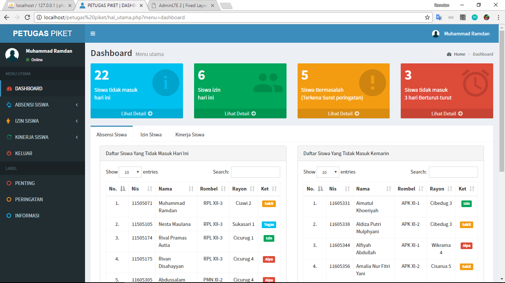
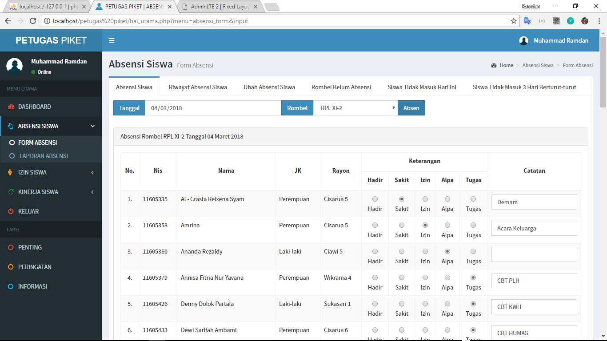
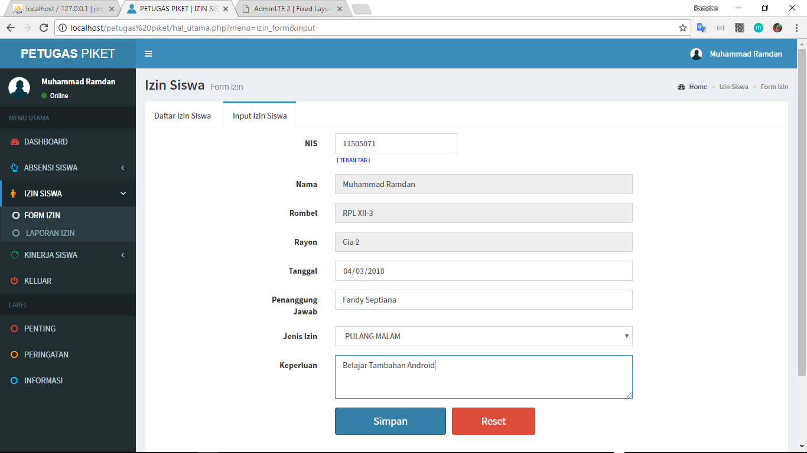
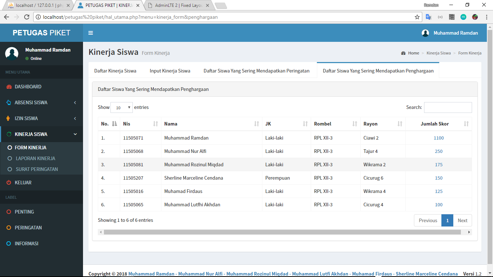
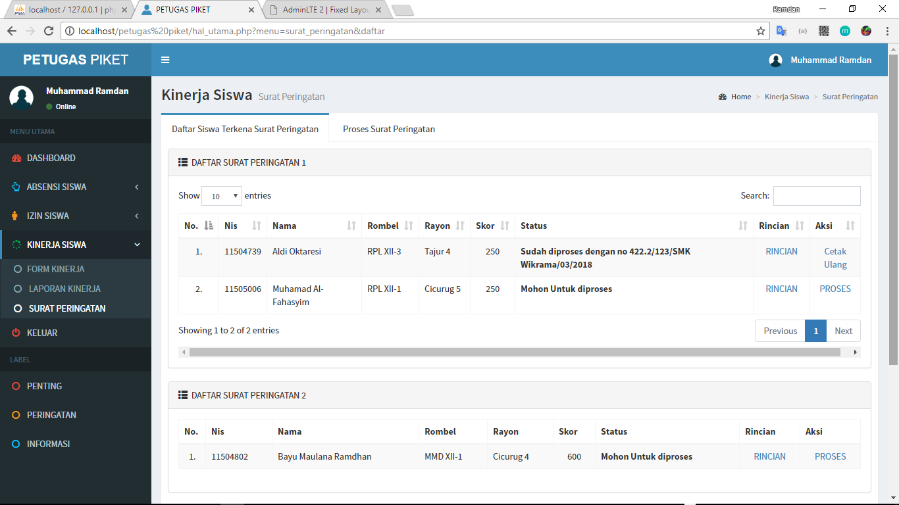

# SIMAP(Sistem Informasi Manajemen Administrasi Perkantoran) Petugas Piket
Sebuah aplikasi berbasis web untuk mengelola sistem petugas piket di suatu sekolah

## Fitur
* Dashboard

* Absensi Siswa

* Izin Siswa

* Kinerja Siswa

* Surat Peringatan

## Teknologi
* PHP 5
* MySQL
* HTML
* CSS
* Javascript
* Bootstrap 

## Info Developer
Jika ada pertanyaan bisa hubungi kontak dibawah : 
* [Email](mailto:ramdanzidun@gmail.com) - ramdanzidun@gmail.com
* [LinkedIn](https://www.linkedin.com/in/rmdnzdn/) - Muhammad Ramdan
* [Instagram](https://www.instagram.com/rmdnzdn/) - @rmdnzdn

